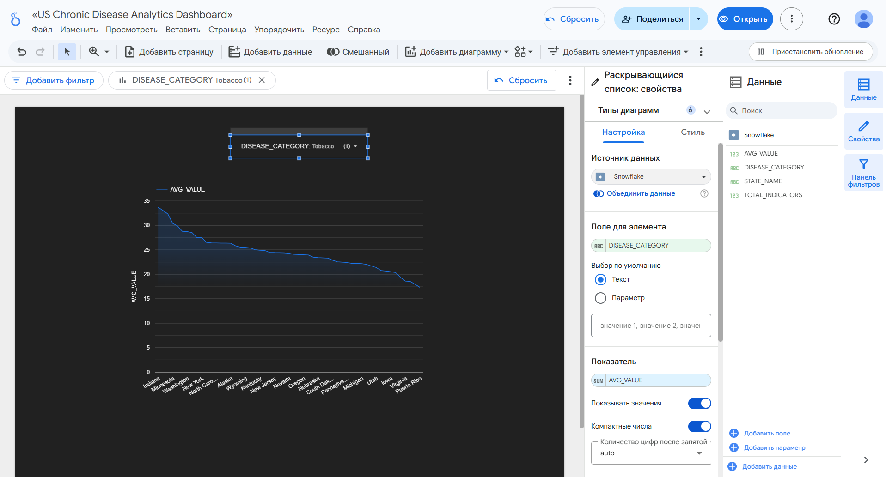

# MedTech Data Engineering Project: US Chronic Disease Analytics

## 📋 Project Overview
This project demonstrates an end-to-end data pipeline for processing and analyzing US chronic disease data (CDC). It covers everything from raw data ingestion to interactive visualization, following professional Data Engineering practices.

## 🛠 Tech Stack
- **Cloud Warehouse:** Snowflake
- **Transformation Tool:** dbt (Data Build Tool)
- **Language:** SQL (Jinja)
- **Visualization:** Looker Studio
- **Version Control:** GitHub

## 🏗 Data Pipeline Architecture
1. **Extraction & Loading:** Raw CDC data (300k+ rows) was ingested into **Snowflake** using `dbt seed` and managed with `COPY INTO` logic.
2. **Transformation (dbt):**
   - **Staging Layer:** Data cleaning, type casting, and filtering.
   - **Marts Layer:** Developed a **Star Schema** with:
     - `dim_locations`: Dimension table for geographic analysis.
     - `fct_chronic_diseases`: Fact table with pre-aggregated health metrics.
3. **Data Quality:** Implemented automated tests (`unique`, `not_null`) and custom **Jinja macros** for data formatting.
4. **Analytics:** Connected **Looker Studio** to Snowflake for real-time reporting.

## 📊 Dashboard
(https://lookerstudio.google.com/reporting/6c070843-ce79-4bf8-aa50-4b7b1ae8adec)

*Features: Interactive filters by disease category, state-level benchmarking, and automated data refresh.*

## 🚀 How to Run
1. Clone the repo.
2. Configure your `profiles.yml` for Snowflake.
3. Run `dbt seed` to load raw data.
4. Run `dbt run` to build models.
5. Run `dbt test` to verify data quality.