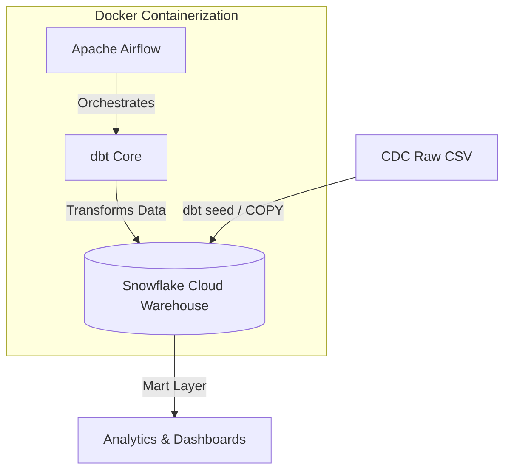
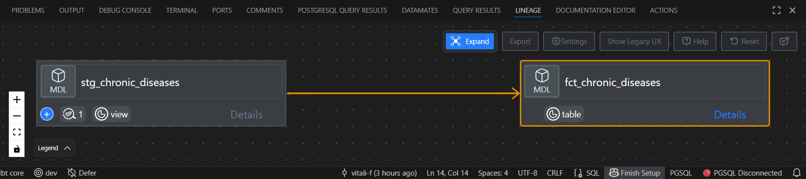
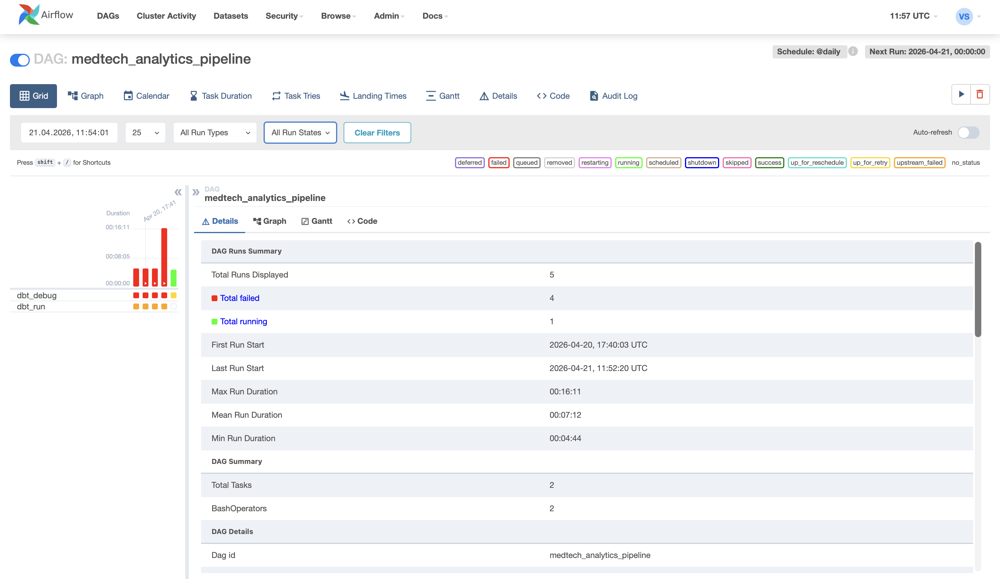
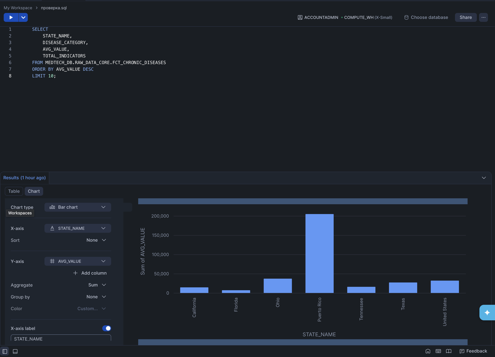

# 🏥 Automated US Chronic Disease Analytics Platform
### *End-to-End Orchestrated Data Pipeline: Airflow | dbt | Snowflake | Docker*

## 📋 Project Overview
This project demonstrates an end-to-end data pipeline for processing and analyzing US chronic disease data (CDC). It covers everything from raw data ingestion to interactive visualization, following professional Data Engineering practices.

## 📌 The Business Context
Chronic diseases are the leading cause of death and disability in the US. Understanding geographic distribution and prevalence is critical for:

Resource Optimization: Directing medical supplies and personnel to high-risk states.

Policy Making: Identifying regions that need urgent healthcare intervention.

Market Analysis: Strategic planning for MedTech and pharmaceutical companies.

## 🏗 Architecture Diagram

## 🌲 Lineage Graph

*Dependency flow showing the transformation from staging views to final analytical fact tables.*

## 🛠 Tech Stack

Cloud Warehouse: Snowflake

Orchestration: Apache Airflow

Transformation Tool: dbt (Data Build Tool)

Containerization: Docker & Docker Compose

Language: SQL (Jinja), Python

Visualization: Snowflake Analytics & Looker Studio

Version Control: GitHub

## 🏗 Data Pipeline Architecture
Extraction & Loading: Raw CDC data (300k+ rows) was ingested into Snowflake using dbt seed and managed with COPY INTO logic.

Transformation (dbt):

Staging Layer: Data cleaning, type casting, and filtering.

Marts Layer: Developed a Star Schema with:

dim_locations: Dimension table for geographic analysis.

fct_chronic_diseases: Fact table with pre-aggregated health metrics.

Orchestration (Airflow): Automated daily runs of the transformation and testing process, ensuring data freshness and pipeline resilience.

Data Quality: Implemented automated tests (unique, not_null) and custom Jinja macros for data formatting.

Analytics: Connected Looker Studio to Snowflake for real-time reporting.

## 📈 Operational Monitoring & Analytics

### ⚙️ Pipeline Orchestration (Apache Airflow)
The entire lifecycle is automated and monitored. The DAG manages dependencies, ensuring dbt runs and tests are executed in the correct order.

### 📊 Business Intelligence (Snowflake)
Final analytical output showcasing the distribution of chronic disease indicators across states, processed through the dbt Core layer.

## 📊 Dashboard
(https://lookerstudio.google.com/reporting/6c070843-ce79-4bf8-aa50-4b7b1ae8adec)

*Features: Interactive filters by disease category, state-level benchmarking, and automated data refresh.*

🚀 How to Run

1.Clone the repo.

2.Configure your profiles.yml for Snowflake.

3.Run the environment: docker-compose up -d.

4.Run dbt seed to load raw data.

5.Run dbt run to build models.

6.Run dbt test to verify data quality.
